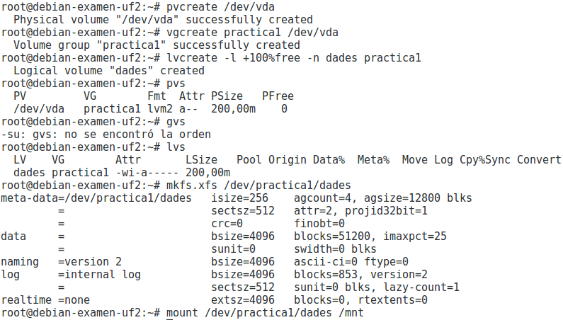
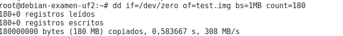
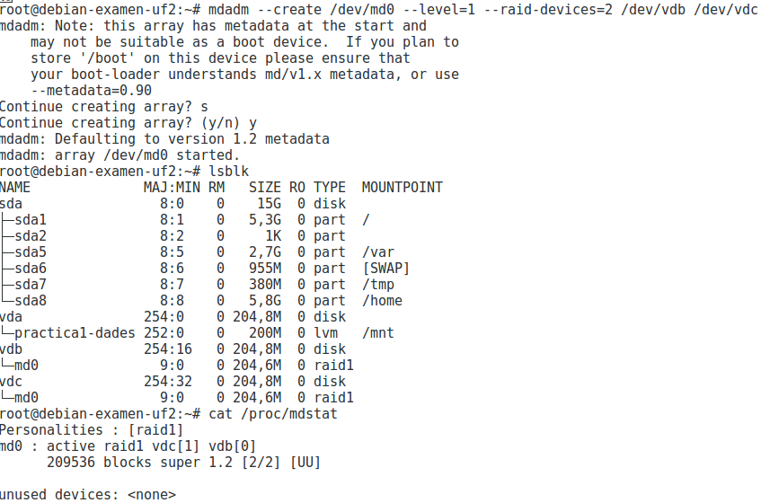
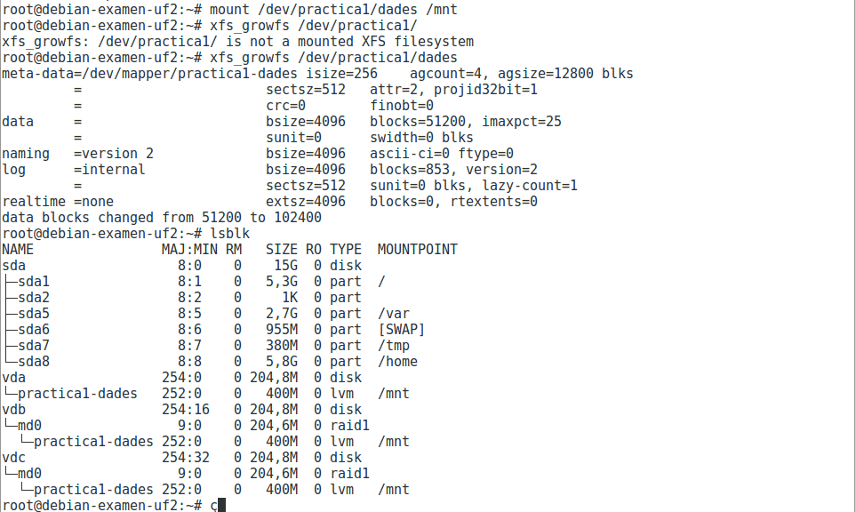

# GESTIÓ DE VOLUMS LÒGICS  

## QUÈ SÓN?  

 * Els volums lògics son unitats de disc virtualitzades quie permeten fer més funcions que les clàssiques particions  

## DESCRIPCIÓ:  

| **PV** | Physical Volume ~ Identificació de discs |         
| **VG** | Volume Group ~ Discs Virtuals |  
| **LV** | Logical Volume ~ Particións |  

													
		                                            
		                                            
## COMANDES:   

**pvcreate** --> S'utilitza pre crear PV  
**vgcreate nombre-vg ruta-pv1 ruta-pv2 etc.** --> S'utilitza per crear VG  
**lvcreate -l +100%FREE> -n nombre-lv** --> S'utilitza per crear un LV amb tot l'espai lliure  
**lvcreate -L tamany -n nombre-lv ruta-vg-donde-lo-quieres-crear** --> S'utilitza per crear un LV amb el tamany que tu vulguis   
**pvs** --> llista els punts de muntatge   
**vgextend** --> Augmenta la mida del VG  
**lvextend** --> Augmenta la mida del LV  

## ENTORN DE PRACTIQUES:  

> Explicar com farem la pràctica detalladament (màquina virtual i afegir tres discs de 200M)    

**Pràctica 1: Creació d'un volum lògic a partir d'un dels tres discs durs (vda per exemple). Aquest volum lògic ha de ser del total de capacitat del disc. El volum de grup s'ha de dir practica1 i el volum lògic dades.**      

**Pràctica 2: Creació d'un sistema de fitxers xfs al volum lògic creat i muntatge a /mnt. També s'ha de crear un fitxer amb dd de 180MB.**       

    
    

* Primer de tot afegim 3 discs ***VirtIO***, Despres identifiquem un dels discs con **PV**. Seguidament creem el **VG** practica1 y per finalitzar creem el **LV**, veiem que tot a quedat bé mitjaçant *pvs* y *lvs*. Per finalitzar creem un sistema 	de fitxers xfs i el punt de muntatge sera /mnt a més afegirem un fitxer de 180MB amb el *dd* 

**Pràctica 3: Creació d'un RAID 1 als dos discos sobrants (vdb i vdc per exemple).**    

      
 * Primer de tot tenim que identificar quins disc faran el RAID, una vegada fet això podem crear el RAID amb la comanda *"mdadm --create (nombre-RAID) --level=(tipus-RAID) --raid-devices=(nº de raids) (disc1) (etc.)"*    

**Pràctica 4: Ampliació del volum lògic de dades al raid.**      

      

* Primer de tot tenim que convertir el RAID *md0* en un **PV** amb la comanda *"pvcreate /dev/md0"*, a continuació utilitzem el tamany del RAID per expandir el **VG** amb la comanda *"vgextend practica1 /dev/md0"*, y finalitzem afegim tot l'espai lliure al **LV** amb la comanda *"lvextend -l +100%free /dev/practica1/dades"*     

**Pràctica 5: Ampliació del sistema de fitxers xfs al tamany actual del volum lògic dades (s'ha de poder fer sense desmuntar-lo de /mnt ja que és xfs). Una vegada creat crearem un nou fitxer de 180M.**      

    

* Per finalitzar augmentem el tamany del sistema de fitxers amb la seguent comanda *""xfs_growfs /dev/practica1/dades"*  
