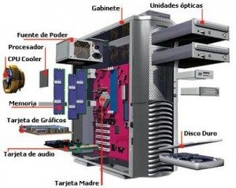

# REPOSITORI DEL M01
***MUNTATGE I MANTENIMENT EQUIPS***  
_Professor: Josep Maria Viñolas Auquer_  
1. Github (_comandes_)
* git status
* git add
* git commit - am "text"
* git push
* git pull

[MOODLE M01](https://moodle.escoladeltreball.org/course/view.php?id=791)

> IMATGE HARDWARE  

